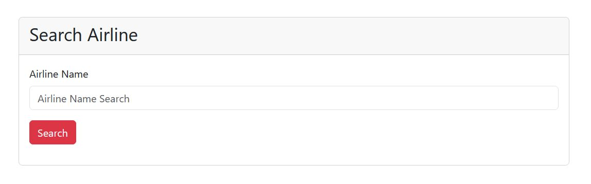

# ✈️ Airline Search App

A simple React application that allows users to search for airline information using the API Ninjas Airline API.

## 📸 Preview

> Add a screenshot of your project here.



---

## 🚀 Features

- 🔍 Search airlines by name
- 📄 Display airline information
- 🖼️ Show airline logo (if available)
- ❌ Error message for invalid airline names
- ⚠️ Validation for empty input
- 📱 Responsive UI with Bootstrap
- 🌐 Fetch data using Axios

---

## 🛠️ Technologies Used

- React
- Axios
- Bootstrap 5
- API Ninjas Airline API

---

## 📦 Installation

Clone the repository

```bash
git clone https://github.com/setareh-kazemi10/react-api-airline
```

Go to the project directory

```bash
cd react-api-airline
```

Install dependencies

```bash
npm install
```

Run the project

```bash
npm start
```

For Vite projects use:

```bash
npm run dev
```

---

## 📂 Project Structure

```
src/
│
├── assets/
│   └── airline.jpg
│
├── App.jsx
├── main.jsx
└── ...
```

---

## 🔑 API

This project uses the **API Ninjas Airline API**.

To use your own API key:

1. Create an account on API Ninjas.
2. Generate your API Key.
3. Replace the API key in the request or use an `.env` file.

---

## 🎯 Future Improvements

- Loading Spinner
- Search on Enter key
- Better error handling
- Dark Mode
- More airline information
- Search history

---

## 👨‍💻 Author

Created by **Setareh Kazemi**

GitHub:
https://github.com/setareh-kazemi10
